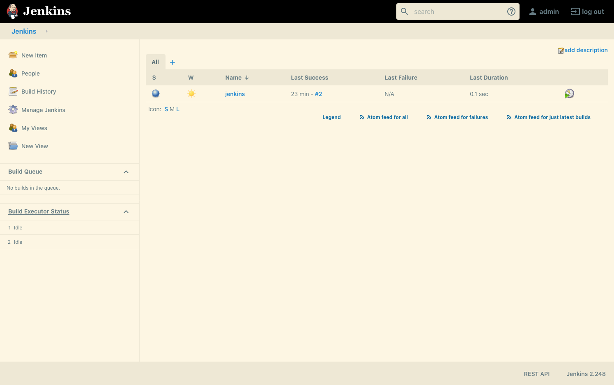
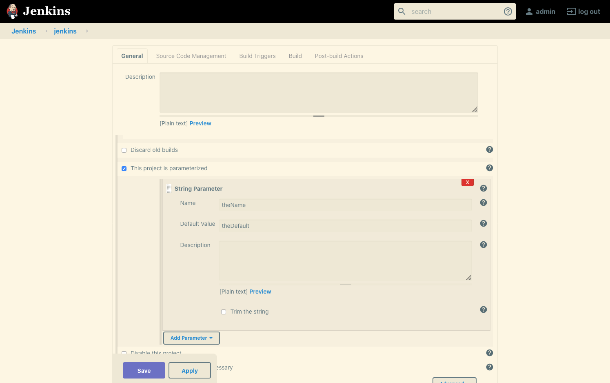
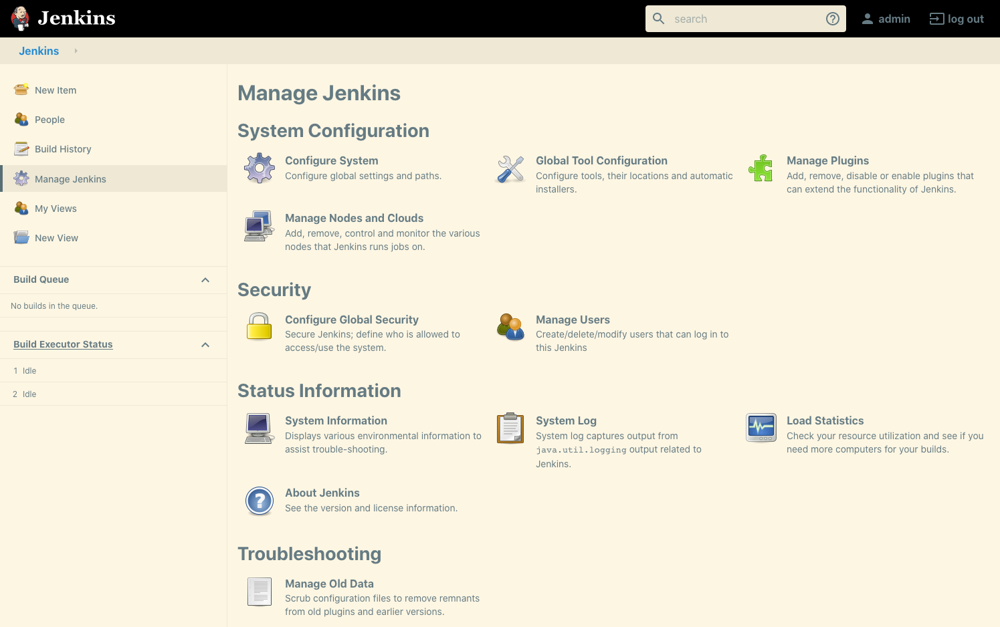
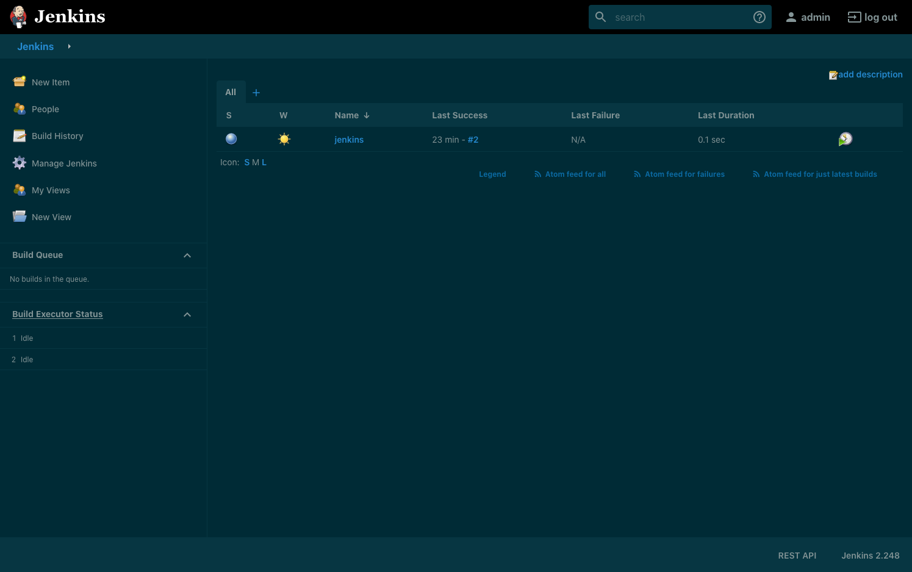
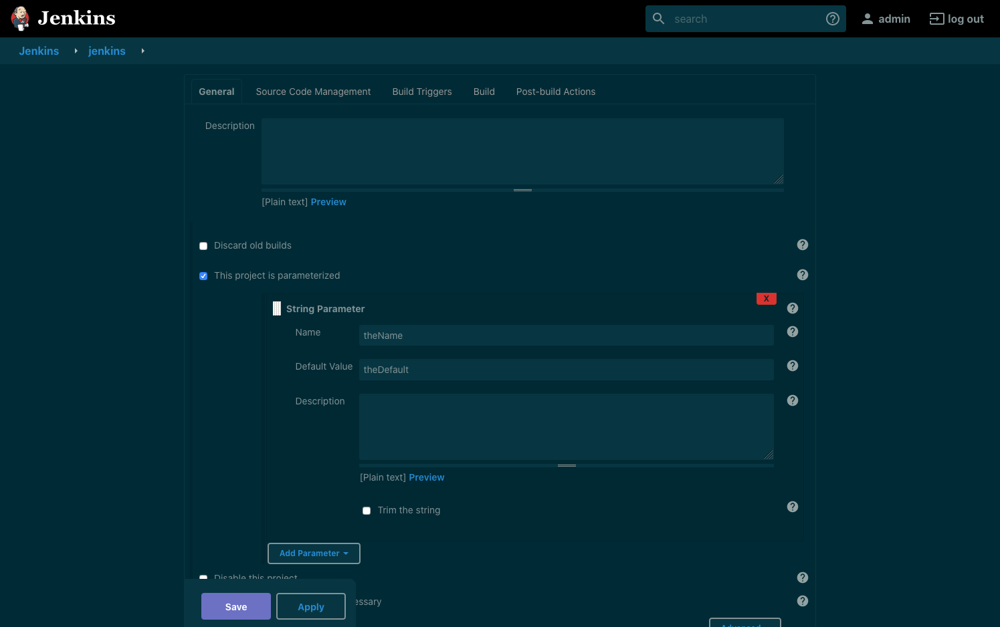
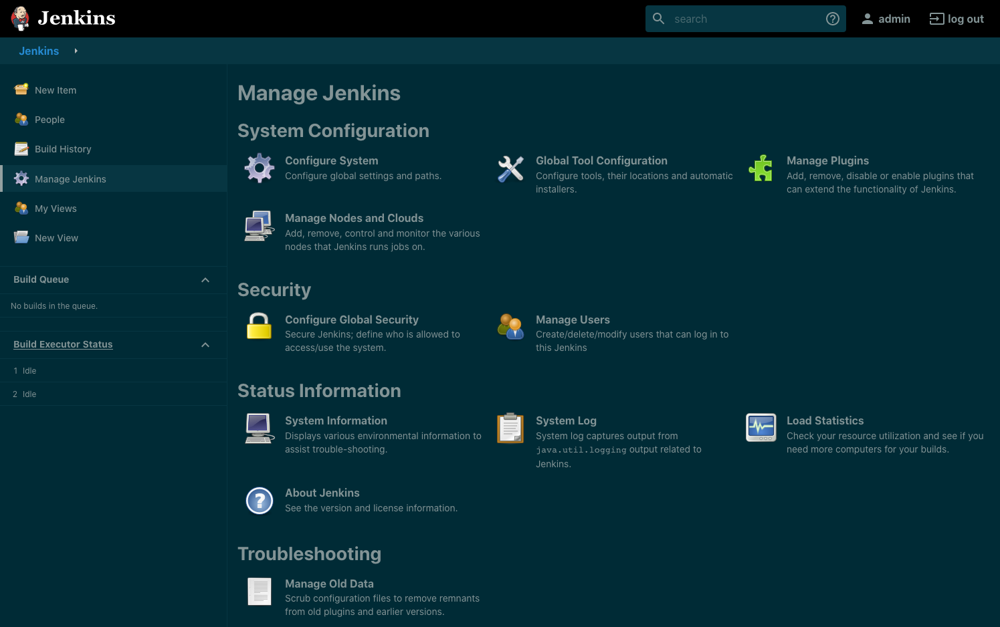

= Solarized Theme Plugin

== Introduction

This plugin provides Solarized (Light and Dark) themes for Jenkins.

Learn more about the Solarized color scheme https://ethanschoonover.com/solarized[on its website].

IMPORTANT: This plugin is still an early work in progress. Jenkins isn't quite as themeable as we would like yet, so some things will not look as expected. Help in developing this theme, and Jenkins theming support in general, would be appreciated.

== Screenshots

[cols="1a,1a,1a"]
|===
| List View | Job Configuration | Manage Jenkins

| [link=images/light-view.png]

| [link=images/light-config.png]

| [link=images/light-manage.png]

| [link=images/dark-view.png]

| [link=images/dark-config.png]

| [link=images/dark-manage.png]

|===

== Getting started

After installing this plugin, go to _Manage Jenkins » Configure System » Built-In Themes_ and select one of the Solarized themes listed there:

* Solarized (System), which will be light or dark depending on user preference.
* Solarized Dark, which will be dark for all users
* Solarized Light, which will be light for all users

== Contributing

Refer to our https://github.com/jenkinsci/.github/blob/master/CONTRIBUTING.md[contribution guidelines].

== LICENSE

Licensed under MIT, see link:LICENSE.md[LICENSE].

